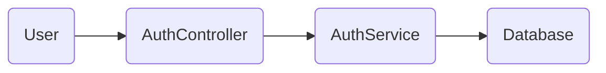

Fire idea. You’re basically describing a **persistent memory layer for your codebase + AI agent**. Think “living wiki + brain + git-aware observer”.

Here’s a clean, practical way to build it without overcomplicating things 👇

---

## 🎯 The Goal

You want a system that can:

* Understand the *current state* of your codebase
* Track *what changed* (via Git)
* Generate & update:

  * Architecture docs
  * Flowcharts
  * System memory for the agent
* Act like a **wiki + memory** for your AI coding assistant

---

## 🧱 High-level Architecture (Simple & Powerful)

Think 5 core pieces:

```
┌───────────────┐
│  Your Code    │
└───────┬───────┘
        │
        ▼
┌───────────────┐
│ Git Observer  │  <-- git diff / git status
└───────┬───────┘
        │
        ▼
┌───────────────┐
│ File Scanner  │  <-- AST + metadata
└───────┬───────┘
        │
        ▼
┌───────────────┐
│   LLM Layer   │  <-- turns code -> knowledge
└───────┬───────┘
        │
        ▼
┌───────────────┐
│ Wiki + Memory │  <-- markdown + graphs + vectors
└───────────────┘
```

---

## 🛠️ How To Build It (Practical Plan)

### 1. Create the “Observer” (Git Brain)

This part watches your repo:

```bash
git status
git diff
git log -1
```

And saves results in a structured way.

Use Node or Python:

```js
import { execSync } from "child_process";

const status = execSync("git status --short").toString();
const diff = execSync("git diff").toString();

console.log({ status, diff });
```

You now have a “change feed” for your AI.

---

### 2. Create the “Scanner” (Code Understanding)

You don’t want to throw all files to the LLM. Too expensive.

So we:

* Parse structure
* Extract important stuff

Use:

✅ For TS/JS/Angular/Nest

* `ts-morph`
* `madge`
* `tree-sitter`

Get:

* Services
* Controllers
* APIs
* Models
* Imports
* Exports

Save as JSON:

```json
{
  "file": "user.service.ts",
  "functions": ["createUser", "getUser"],
  "imports": ["mongoose", "bcrypt"],
  "exports": ["UserService"],
  "dependencies": ["UserModel"]
}
```

---

### 3. Create the “Knowledge Builder” (LLM Layer)

Now you feed the LLM:

```text
Here is the current structure of a file + diff.
Update the system documentation and flowcharts.
Return markdown & mermaid diagrams.
```

Outputs:

✅ Updated markdown docs
✅ Updated Mermaid diagrams
✅ Summaries of what changed
✅ Warnings (breaking change etc)

---

### 4. Create the Wiki Structure

Inside your repo:

```
/.codewiki
   /memory
   /diagrams
   /summaries
   /flows
   index.md
```

Example:

**memory/system.md**

```md
## Authentication System

Uses JWT & Refresh tokens

Main files:
- auth.service.ts
- auth.controller.ts
- jwt.strategy.ts

Flow:
User → Controller → Service → MongoDB
```

**diagrams/auth-flow.mmd**



Use:

* Docusaurus / MkDocs / Obsidian

Boom = Codebase Wikipedia.

---

### 5. Give Your Agent Access To It (The Magic)

Whenever agent starts work:

1. It reads:

```
.codewiki/memory/system.md
.codewiki/diagrams/*
```

2. You also send:

```bash
git status
git diff
```

3. Agent uses this as **long-term context**

Now it understands:
✅ Your architecture
✅ Your patterns
✅ Your intent
✅ What changed

This is how you give AI long-term memory without relying on chat history.

---

## 👀 Upgrade Mode (Next Level)

Want to go crazy?

Add:

* Vector DB (Chroma / Qdrant)
* Store embeddings of:

  * functions
  * components
  * services
* Now you can do **semantic search** like:

> "Where is transaction logic handled?"

And it will point EXACTLY to the file.

